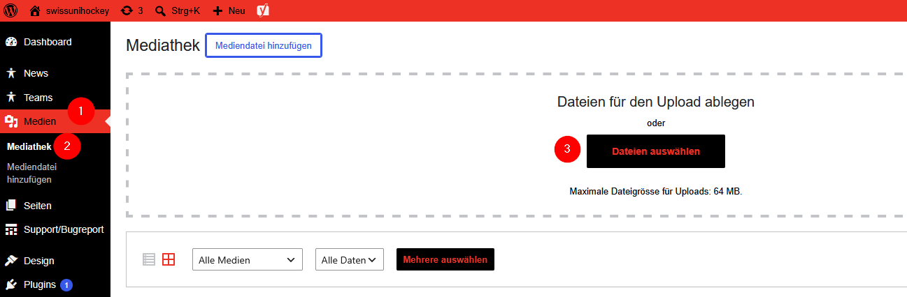
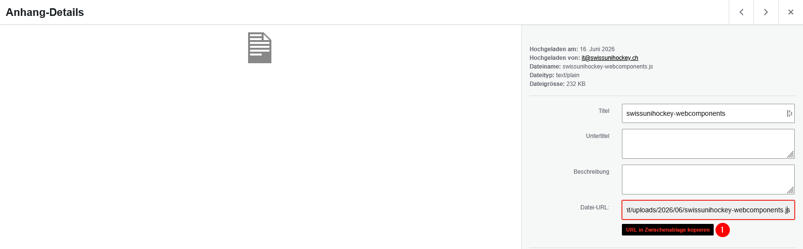
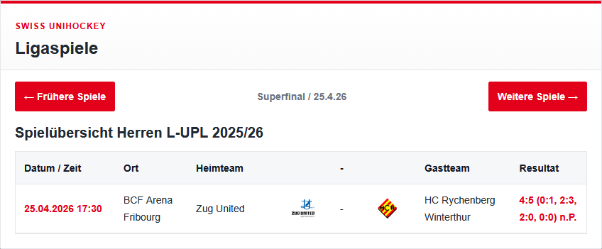
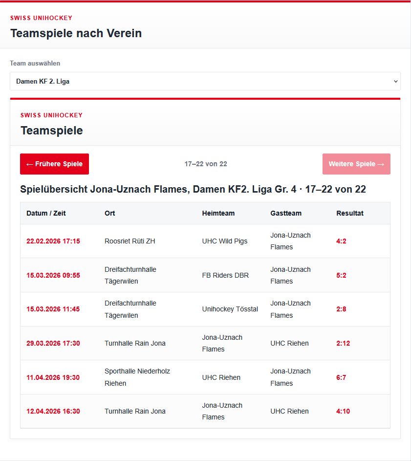
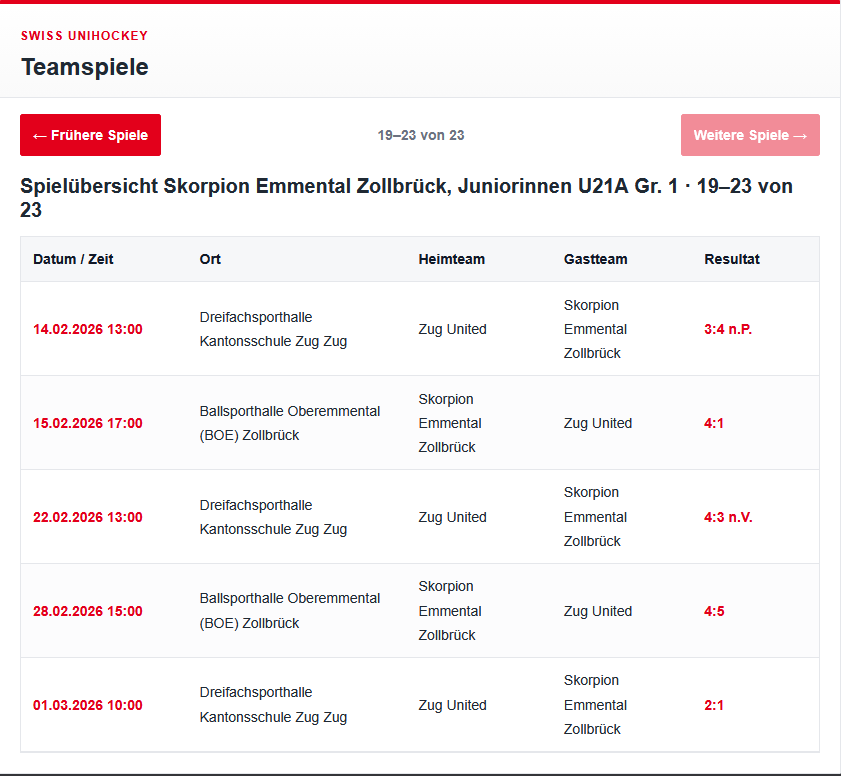
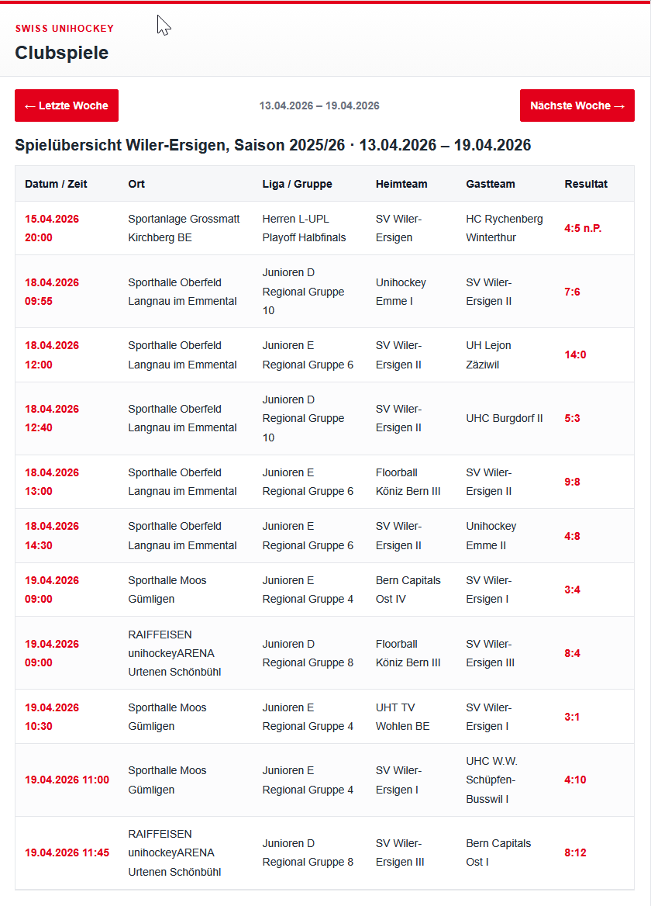
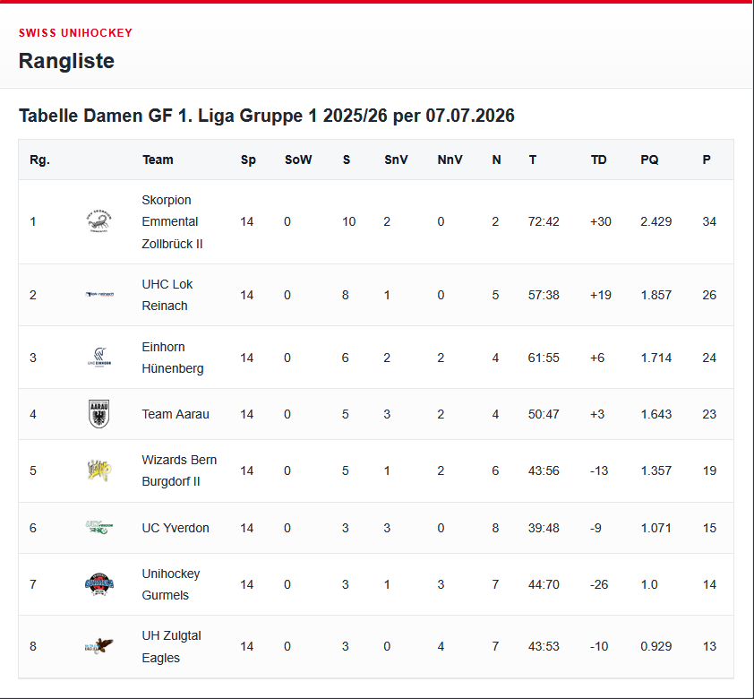
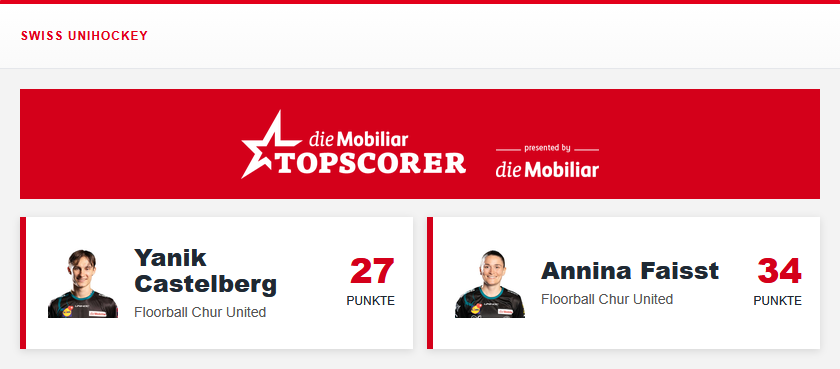

# Einbetten der Web Component auf einem Webseite
## JavaScript und CSS files auf Webserver hochladen.
Als erstes muss man die beiden Files "swissunihockey-webcomponents.js" und "swissunihockey-webcomponents.css" in das Dateiverzeichniss vom Webserver hochladen.
Der Ordner, wo die Dateien hochgeladen werden, muss von den Webseiten anziehbar sein.
Als Beispiel kann man in einer Wordpress Webseite die beiden Dateien in der Mediathek hochladen.

Man muss unter "Medien" auf "Mediathek" gehen und dann kann man dort die Dateien hineinziehen.
Nun muss man auf die beiden hochgeladenen Dateien in der Mediathek klicken und bei beiden die Datei-URL kopieren, wie man auf dem unteren Bild sieht.


Nun kann man auf einer Seite folgender HTML Code einbetten.
Wichtig bei href muss man die Datei-URL vom CSS-File und bei src die Datei-URL vom JS-File reinkopieren.
```js
<link
  rel="stylesheet"
  href="PATH_TO_CSS_FILE">
<p><script
  type="module"
  src="PATH_TO_JS_FILE"><br />
</script></p>
```
Nun kann man auf der Webseite die Blöcke hinzufügen.
Für jedes Team von deinem Verein kannst du die Informationen, welche du für die Blöcke im HTML Code benötigst auf dieser Webseite nachschauen: https://www.swissunihockey.ch/de/administration/services/vereins-ids-finder-fuer-web-component/
Hier findest du die TeamID, LeagueID, GameClassID und die Gruppe, welche für verschiedene Blöcke gebraucht werden.
Es gibt folgende Blöcke die man einbinden kann.

## Ligaspiele
```js
<uniho-league-games 
    game-class="CLASS_ID" 
    league="LEAGUE_ID"
    season="Jahr in dem die Saison beginnt"
    group="Group_Name">
<uniho-league-games>
```
Hier musst du auf der Webseite (https://www.swissunihockey.ch/de/administration/services/vereins-ids-finder-fuer-web-component/) schauen welche GameClassID, LeagueID und Group du benötigst.
Der Block sollte dann wie folgt aussehen:
```js
<uniho-league-games
    game-class="21"
    league="3"
    season="2025" 
    group="Gruppe 1">
</uniho-league-games>
```


## Teamspiele nach Verein
```js
<uniho-club-team-games
    club-id="CLUB_ID"
    season="Jahr in dem die Saison beginnt"
    page-size="Anzahl Spiele pro Seite">
</uniho-club-team-games>
```
Mit diesem Block kann man in einem Fenster direkt alle Teamspiele für jedes Team eines Vereins anzeigen lassen.
Bei diesem Block gibt es noch den Parameter "page-size". Dieser sagt aus, wie viele Spiele von einem Team auf einer Seite ersichtlich sein sollen.
Zusätzlich ist wichtig, dass man bei season das Jahr angibt, in welchem die Saison gestartet ist. Also z.B. für die Saison 2026/2027 müsste man als Parameter 2026 angeben. 
Der Block sollte dann wie folgt aussehen:
```js
<uniho-club-team-games
    club-id="372"
    season="2025"
    page-size="6">
</uniho-club-team-games>
```


## Teamspiele
```js
<uniho-team-games
    season="Jahr in dem die Saison beginnt"
    team-id="TEAM_ID"
    page-size="Anzahl Spiele pro Seite">
</uniho-team-games>
```
Mit diesem Block kann man nur die Spiele von einem spezifischen Team angeben. Auch hier sagt der Parameter "page-size" aus, wie viele Spiele auf einer Seite angezeigt werden sollen.
Dieser Block sollte wie folgt aussehen:
```js
<uniho-team-games
    season="2025"
    team-id="429626"
    page-size="5">
</uniho-team-games>
```


## Vereinsspiele
```js
<uniho-club-games
    season="Jahr in dem die Saison beginnt"
    club-id="CLUB_ID">
</uniho-club-games>
```
In diesem Block werden alle Spiele von einem Club pro Woche angezeigt.
So sieht dies dann aus:
```js
<uniho-club-games
    season="2025"
    club-id="467">
</uniho-club-games>
```


## Rangliste
```js
<uniho-ranking
    season="Jahr in dem die Saison beginnt"
    league="LEAGUE_ID"
    game-class="CLASS_ID"
    group="Group_Name">
</uniho-ranking>
```
Hier wird die Rangliste einer Gruppe angezeigt, dies sieht dann wie folgt aus:
```js
<uniho-ranking
    season="2025"
    league="3"
    game-class="21"
    group="Gruppe 1">
</uniho-ranking>
```


## Mobiliar Topscorer
```js
<uniho-mobiliar-topscorer
    season="Jahr in dem die Saison beginnt"
    club-id="CLUB_ID">
</uniho-mobiliar-topscorer>
```
Für die Vereine, welche einen Mobiliar Topscorer auf ihrer Webseite anzeigen müssen, können sie dies mit diesem Block.
Dies sieht dann wie folgt aus:
```js
<uniho-mobiliar-topscorer
    season="2025"
    club-id="463845">
</uniho-mobiliar-topscorer>
```
